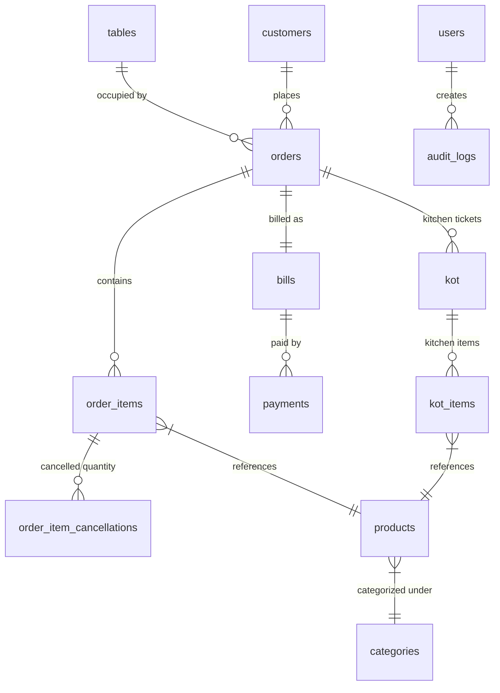

# MealDesk Database Design

This document details the updated database architecture of the Rust + Tauri MealDesk restaurant POS application.

---

## 1. Entity-Relationship Diagrams (Mermaid)

---

## 2. Table Schemas

### `users`
Stores system account credentials.
*   **Columns**:
    *   `id`: `INTEGER PRIMARY KEY AUTOINCREMENT`
    *   `username`: `TEXT NOT NULL UNIQUE`
    *   `password_hash`: `TEXT NOT NULL` (SHA256 hashed password)

### `restaurant_info`
Contains POS settings and receipt printing details. Only one row (`id = 1`) exists.
*   **Columns**:
    *   `id`: `INTEGER PRIMARY KEY`
    *   `name`: `TEXT NOT NULL`
    *   `logo`: `TEXT`
    *   `gstin`: `TEXT`
    *   `address`: `TEXT`
    *   `phone`: `TEXT`
    *   `email`: `TEXT`
    *   `receipt_footer`: `TEXT`

### `categories`
Product classification grouping.
*   **Columns**:
    *   `id`: `INTEGER PRIMARY KEY AUTOINCREMENT`
    *   `name`: `TEXT NOT NULL UNIQUE`
    *   `description`: `TEXT`

### `products`
The menu items list.
*   **Columns**:
    *   `id`: `INTEGER PRIMARY KEY AUTOINCREMENT`
    *   `category_id`: `INTEGER NOT NULL` (Foreign Key to `categories.id`)
    *   `name`: `TEXT NOT NULL UNIQUE`
    *   `price`: `REAL NOT NULL CHECK(price >= 0)`
    *   `gst_rate`: `REAL NOT NULL DEFAULT 5.0 CHECK(gst_rate >= 0)`
    *   `image_path`: `TEXT`
    *   `is_available`: `INTEGER NOT NULL DEFAULT 1 CHECK(is_available IN (0, 1))`

### `tables`
Dine-in tables.
*   **Columns**:
    *   `id`: `INTEGER PRIMARY KEY AUTOINCREMENT`
    *   `name`: `TEXT NOT NULL UNIQUE`
    *   `status`: `TEXT NOT NULL DEFAULT 'Free' CHECK(status IN ('Free', 'Occupied', 'Billed'))`
    *   `merged_into`: `INTEGER` (Self-referential Foreign Key to `tables.id` for table merging)

### `orders`
Dine-in sessions and takeaway orders. Financial amounts have been decoupled from this table.
*   **Columns**:
    *   `id`: `INTEGER PRIMARY KEY AUTOINCREMENT`
    *   `table_id`: `INTEGER` (Foreign Key to `tables.id`, nullable for takeaway)
    *   `customer_id`: `INTEGER` (Foreign Key to `customers.id`, nullable)
    *   `status`: `TEXT NOT NULL DEFAULT 'Pending' CHECK(status IN ('Pending', 'Billed', 'Completed', 'Cancelled'))`
    *   `notes`: `TEXT`
    *   `created_at`: `TEXT NOT NULL`
    *   `cancelled_by`: `TEXT`
    *   `cancelled_at`: `TEXT`
    *   `cancel_reason`: `TEXT`

### `order_items`
Individual items within an order.
*   **Columns**:
    *   `id`: `INTEGER PRIMARY KEY AUTOINCREMENT`
    *   `order_id`: `INTEGER NOT NULL` (Foreign Key to `orders.id` ON DELETE CASCADE)
    *   `product_id`: `INTEGER NOT NULL` (Foreign Key to `products.id`)
    *   `name`: `TEXT NOT NULL` (Snapshot of product name at order time)
    *   `quantity`: `INTEGER NOT NULL CHECK(quantity > 0)`
    *   `price`: `REAL NOT NULL CHECK(price >= 0)` (Snapshot of price at order time)
    *   `gst_rate`: `REAL NOT NULL CHECK(gst_rate >= 0)` (Snapshot of GST rate)
    *   `notes`: `TEXT`
    *   `kot_id`: `INTEGER` (Foreign Key to `kot.id`, nullable)

### `order_item_cancellations`
Audit logs of kitchen cancelled items after KOT generation.
*   **Columns**:
    *   `id`: `INTEGER PRIMARY KEY AUTOINCREMENT`
    *   `order_item_id`: `INTEGER NOT NULL` (Foreign Key to `order_items.id` ON DELETE CASCADE)
    *   `quantity`: `INTEGER NOT NULL CHECK(quantity > 0)`
    *   `reason`: `TEXT NOT NULL`
    *   `cancelled_by`: `TEXT NOT NULL`
    *   `created_at`: `TEXT NOT NULL`

### `bills`
The financial snapshot created when an order is finalized. Decoupled from `orders` in a 1-to-0..1 relationship.
*   **Columns**:
    *   `id`: `INTEGER PRIMARY KEY AUTOINCREMENT`
    *   `order_id`: `INTEGER NOT NULL UNIQUE` (Foreign Key to `orders.id` ON DELETE CASCADE)
    *   `bill_number`: `TEXT NOT NULL UNIQUE` (Formatted reference like `BILL-00001`)
    *   `subtotal`: `REAL NOT NULL CHECK(subtotal >= 0)`
    *   `discount`: `REAL NOT NULL DEFAULT 0.0 CHECK(discount >= 0)` (Discount percentage)
    *   `tax`: `REAL NOT NULL DEFAULT 0.0 CHECK(tax >= 0)`
    *   `service_charge`: `REAL NOT NULL DEFAULT 0.0 CHECK(service_charge >= 0)` (Service charge percentage)
    *   `round_off`: `REAL NOT NULL DEFAULT 0.0`
    *   `total`: `REAL NOT NULL CHECK(total >= 0)`
    *   `status`: `TEXT NOT NULL DEFAULT 'Unpaid' CHECK(status IN ('Unpaid', 'Paid', 'Cancelled'))`
    *   `created_at`: `TEXT NOT NULL`
    *   `billed_at`: `TEXT`

### `payments`
Detailed breakdown of multiple payment transactions made for a bill. Supports cash, digital UPI, cards, and non-chargeable (NC) transactions.
*   **Columns**:
    *   `id`: `INTEGER PRIMARY KEY AUTOINCREMENT`
    *   `bill_id`: `INTEGER NOT NULL` (Foreign Key to `bills.id` ON DELETE CASCADE)
    *   `payment_method`: `TEXT NOT NULL CHECK(payment_method IN ('Cash', 'UPI', 'Card', 'NC'))`
    *   `amount`: `REAL NOT NULL CHECK(amount >= 0)`
    *   `created_at`: `TEXT NOT NULL`

### `kot`
Kitchen Order Tickets generated per order additions.
*   **Columns**:
    *   `id`: `INTEGER PRIMARY KEY AUTOINCREMENT`
    *   `order_id`: `INTEGER NOT NULL` (Foreign Key to `orders.id`)
    *   `status`: `TEXT NOT NULL DEFAULT 'Pending' CHECK(status IN ('Pending', 'Preparing', 'Ready', 'Completed'))`
    *   `print_count`: `INTEGER NOT NULL DEFAULT 0 CHECK(print_count >= 0)`
    *   `created_at`: `TEXT NOT NULL`

### `kot_items`
Detailed items inside a single KOT. Negative quantities represent kitchen cancellations.
*   **Columns**:
    *   `id`: `INTEGER PRIMARY KEY AUTOINCREMENT`
    *   `kot_id`: `INTEGER NOT NULL` (Foreign Key to `kot.id` ON DELETE CASCADE)
    *   `product_id`: `INTEGER NOT NULL` (Foreign Key to `products.id`)
    *   `quantity`: `INTEGER NOT NULL CHECK(quantity <> 0)`
    *   `notes`: `TEXT`

### `customers`
Loyalty profiles directory.
*   **Columns**:
    *   `id`: `INTEGER PRIMARY KEY AUTOINCREMENT`
    *   `name`: `TEXT NOT NULL`
    *   `phone`: `TEXT NOT NULL UNIQUE`
    *   `email`: `TEXT`
    *   `loyalty_points`: `INTEGER NOT NULL DEFAULT 0 CHECK(loyalty_points >= 0)`

### `audit_logs`
Actions logging for security tracking.
*   **Columns**:
    *   `id`: `INTEGER PRIMARY KEY AUTOINCREMENT`
    *   `username`: `TEXT NOT NULL`
    *   `action`: `TEXT NOT NULL`
    *   `target_type`: `TEXT NOT NULL`
    *   `target_id`: `INTEGER`
    *   `details`: `TEXT`
    *   `created_at`: `TEXT NOT NULL`
